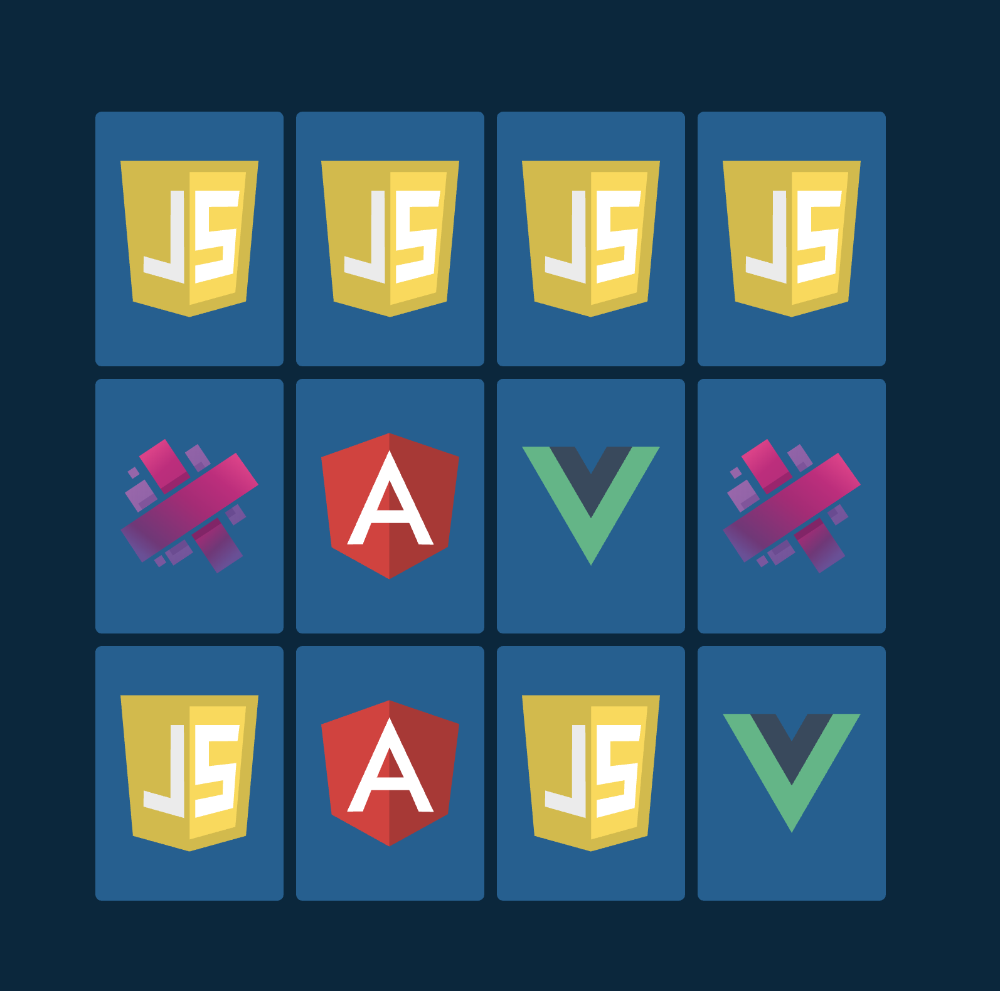

# Wild Cards Game

## Overview

Wild Cards Game is a browser-based card game developed using JavaScript. The game features a deck of cards with unique characters and abilities, providing players with an immersive and strategic gaming experience.

## Features

- **Dynamic Gameplay:** Experience dynamic gameplay with a diverse range of cards and abilities.
- **Strategic Depth:** Strategize and plan your moves to outsmart your opponents and emerge victorious.
- **Single Player Mode:** Enjoy the game in single-player mode against AI opponents.
- **Multiplayer Mode:** Challenge friends or other players online in multiplayer mode for competitive matches.
- **Customizable Decks:** Build and customize your own decks with unique combinations of cards.
- **Responsive Design:** Play the game seamlessly across different devices with responsive design.

## How to Play

1. **Access the Game:** Open the game in a web browser by navigating to the provided URL.
2. **Game Interface:** Familiarize yourself with the game interface, including the deck of cards, player information, and game board.
3. **Gameplay:** Follow the on-screen instructions to play the game, including selecting cards, making moves, and utilizing abilities.
4. **Single Player Mode:** Choose single-player mode to play against AI opponents for practice or entertainment.
5. **Multiplayer Mode:** Enter multiplayer mode to challenge friends or other players online for competitive matches.

## Getting Started

To get started with the Wild Cards Game, follow these steps:

1. **Clone the Repository:** Clone the project repository to your local machine using Git:
git clone 
https://github.com/mohamedmelrayes/Wild-Cards-Game-.git

2. **Open the Game:** Open the `index.html` file in a web browser to launch the game.

3. **Play the Game:** Start playing the game by following the on-screen instructions and enjoying the immersive gaming experience.

## Contributions

Contributions to the Wild Cards Game project are welcome! If you would like to contribute, please follow these steps:

1. Fork the repository.
2. Create a new branch (`git checkout -b feature/your-feature`).
3. Make your changes.
4. Commit your changes (`git commit -am 'Add new feature'`).
5. Push to the branch (`git push origin feature/your-feature`).
6. Create a new Pull Request.

## License

This project is licensed under the MIT License - see the [LICENSE](LICENSE) file for details.
